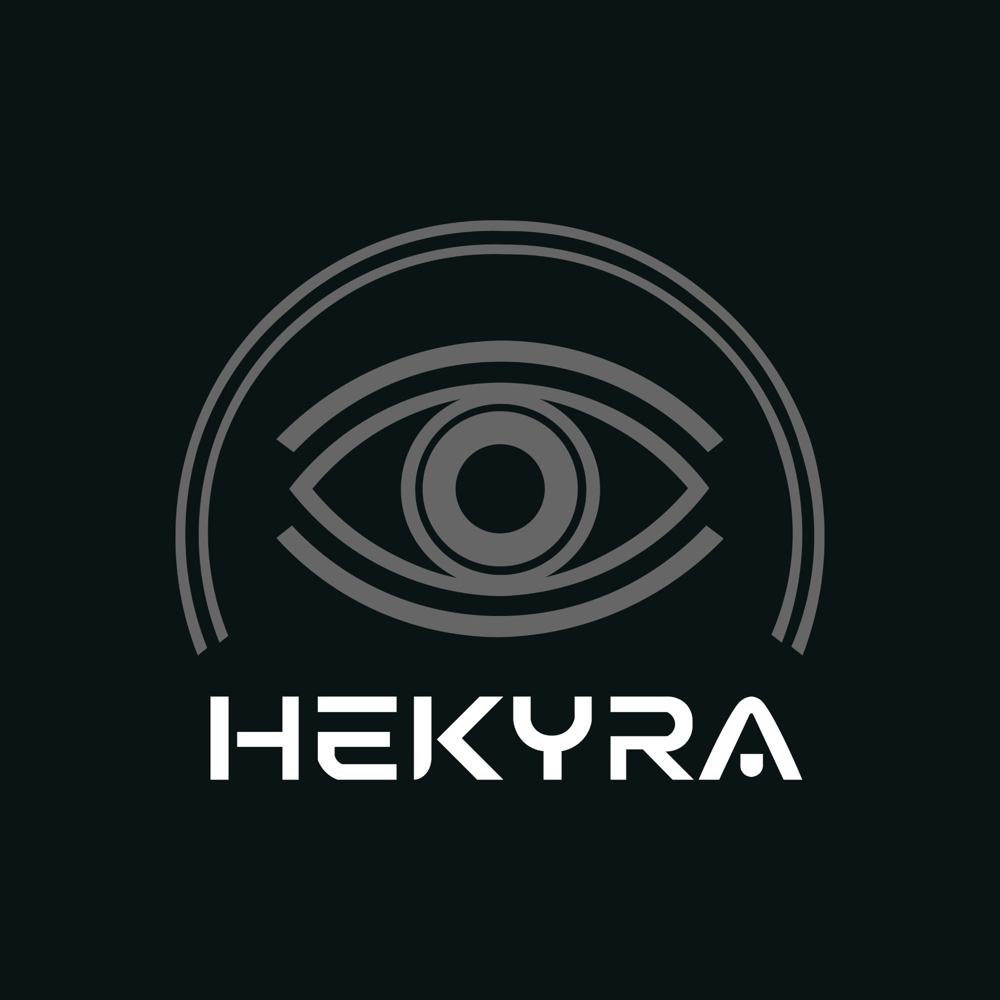

<!-- ██████████████████████████████████████████████████████████████ -->
<!-- ░░░░░░░░░ ctOS v4.2.1 // PROFILE: ARITZ_RIVAS ░░░░░░░░░░░ -->
<!-- ██████████████████████████████████████████████████████████████ -->

<!-- BANNER ANIMADO -->
<div align="center">
  <a href="https://github.com/MrAritz">
    
  </a>
</div>

<!-- ABOUT ME — MISSION BRIEFING -->

### `> cat /mission/briefing.txt`
---

```yaml
Name:       Aritz Rivas
Alias:      MrAritz
Location:   Spain 🇪🇸
Class:      Network & Software Engineer
Faction:    Hekyra — Founder & CEO
Status:     Building. Breaking. Fixing. Repeat.
```

Ingeniero de redes, ciberseguridad y software. Fundador de **[Hekyra](https://www.hekyra.com)** — donde convertimos la tecnología en una ventaja, no en un problema. Combino la mentalidad hacker con la ingeniería de software: no me conformo con que las cosas funcionen, necesito entender **por qué** funcionan, **cómo** se rompen, y **qué pasa** cuando empujas los límites.
 
> *"Toda solución empieza por entender el problema."*
 
<!-- HEKYRA SECTION -->
 

 
### `▸ FACTION // HEKYRA`
 ---
<div align="center">
 
  <a href="https://www.hekyra.com">
    
  </a>
 
<br/><br/>
 
**Tecnología que funciona. Seguridad en la que confiar.**
 
<br/>
 
<table>
<tr>
<td align="center" width="50%">
 
**🔒 Hekyra Security**
 
Auditorías · Pentesting · Análisis de Vulnerabilidades
Hardening de Red · Infraestructura de Red
 
</td>
<td align="center" width="50%">
 
**💻 Hekyra Dev**
 
Software a Medida · Webs Profesionales
Automatizaciones · Bases de Datos
 
</td>
</tr>
</table>
 
[](https://www.hekyra.com)
[](https://instagram.com/Hekyraaas)
[](https://x.com/Hekyraaas)
[](DISCORD_INVITE_LINK)
 
</div>
 


### `▸ SKILL_TREE // ACTIVE_ABILITIES`
---
<div align="center">
  
</div>

<!-- TECH STACK — INVENTARIO -->

### `▸ INVENTARIO // TECH_STACK`
---
<div align="center">

#### ⚔️ Lenguajes


 
#### 🛡️ Frameworks & Plataformas


 
#### 🧪 Infraestructura & DevOps


 
#### 🗄️ Bases de Datos


 
#### 💻 Sistemas & Scripting


 
</div>
<!-- GITHUB STATS — GAME STATS -->

### `▸ GAME_STATS // RENDIMIENTO`
---
<br/>
<div align="center">
<a href="https://github.com/MrAritz">
  
</a>
&nbsp;&nbsp;
<a href="https://github.com/MrAritz">
  
</a>

<br/><br/>


<br/><br/>

<!-- CONTRIBUTION GRAPH -->


</div>

<!-- TROPHIES -->


### `▸ LOGROS // ACHIEVEMENTS_UNLOCKED`
---
<div align="center">


</div>
<!-- CONTACT — CONEXIONES -->


### `▸ NETWORK // ESTABLECER_CONEXIÓN`
---
<br/>
<div align="center">

[](https://x.com/MrAriitz)
[](https://instagram.com/MrAriitz)
[](mailto:aritzrivas@hekyra.com)
[](https://www.hekyra.com)

</div>
<br/>

```
┌──────────────────────────────────────────────────────────────┐
│                                                              │
│   Si has llegado hasta aquí...                               │
│                                                              │
│   ░█▀▀ ░█▀▀█ ░█▀▀▀█ ▀▀█▀▀ ░█▀▀▀ ░█▀▀█                     │
│   ░█▀▀ ░█▄▄█ ─▀▀▀▄▄ ─░█── ░█▀▀▀ ░█▄▄▀                     │
│   ░█▄▄ ░█─░█ ░█▄▄▄█ ─░█── ░█▄▄▄ ░█─░█                     │
│                                                              │
│   ...easter egg encontrado. Ya me caes bien. 🎮              │
│                                                              │
└──────────────────────────────────────────────────────────────┘
```

<br/>


</div>

<!-- HIDDEN EASTER EGG -->
<!-- 
  ██╗  ██╗ █████╗  ██████╗██╗  ██╗    ████████╗██╗  ██╗███████╗    
  ██║  ██║██╔══██╗██╔════╝██║ ██╔╝    ╚══██╔══╝██║  ██║██╔════╝    
  ███████║███████║██║     █████╔╝        ██║   ███████║█████╗      
  ██╔══██║██╔══██║██║     ██╔═██╗        ██║   ██╔══██║██╔══╝      
  ██║  ██║██║  ██║╚██████╗██║  ██╗       ██║   ██║  ██║███████╗    
  ╚═╝  ╚═╝╚═╝  ╚═╝ ╚═════╝╚═╝  ╚═╝       ╚═╝   ╚═╝  ╚═╝╚══════╝    
  
  PLANET → Encontraste el segundo easter egg. Bienvenido al club. 🕹️
  
  "La información quiere ser libre" — Stewart Brand
-->
